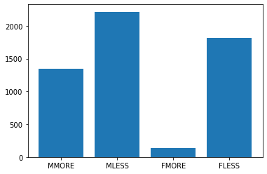

# Income and what does actually matter when it comes to it?

## Overview and motivation

With a rising cost of living and tough economic times it becomes quite evident that the income level of the person will directly affect one's quality of life and is a factor that unfortunately cannot be neglected.

But what does truly affect the paycheck? Are all variables of the equation under our own control or are there some outside factors that will have its mark on the result? The motivation of the project is exactly to try to find out what matters the most. So let's get started.

## Data

The data set was extracted from 'Census bureau database' and it has over 40k entries. The dataset was out of the box quite clean, but... There were two main issues:

a) Inputs contained enormous amount of categorical variables

b) Output itself was a categorical value as well.

The reason why following is quite a big issue is that categorical values are quite difficult to handle even with all the available tools and techniques that are present now in DS.

But, of course it doesn't mean that the data is completely pointless, so let's list all the columns that were chosen to be tested as factors that might affect the income.

```
Age, workclass, education, occupation, race, sex and country of origin
```

## Start of the research

In beginning it is always important to start with a more detailed review of data. Overview has shown that there were some missing values in the columns that we wanted to use. It was decided to replace the unknown values with mode of the column. The data was also unevenly distributed, which can lead to quite a bit of inaccuracies, especially in the ML model, due to the overtraining. In order to prove the point as an example I have chosen to show, if there is a direct discrimination towards females in the dataset. Given all the males/ females working in `sales` we have graphed in the bar chart their annual income.



Well, it doesn't look too good. But, if take a look at the education level of the survey participants, then the picture becomes a little more evident.


Oh, well, but the number of females in the survey is much less than males, so we have to take a look at the proportions.

```python
Proportion of men having bachelor's degree: 0.28029238122012934
Proportion of men having master's degree: 0.046949676693843125
Proportion of women having bachelor's degree: 0.1391884951206985
Proportion of women having bachelor's degree: 0.020030816640986132
```

That in fact gives us a better insight on why the salaries differ. But it is clear, that the difference in salaries is much bigger than the difference in education level.

We could have proceeded with the same statistical analysis approach, which is not bad, but pretty time consuming, as we will have to try out different combination of variables to see the bigger picture. So we proceed with a ML part of the project, keeping in mind the points above.

## Trial and error.

After manipulating categorical data in 2 different ways and trying out quite a bit of different models with different parameters it turned out that MLP (with one-hot encoded data) was the model of choice with an accuracy of... 82.35%

Sounds quite bad and indeed it is not the best accuracy, however we will have to keep in mind that the output data was not continuous, but categorical, which could have affected the accuracy. However, it is also (highly) possible that the dataset itself did not have enough correlation.

## Making conclusions via model's predictions

The setup was simple. The way we tested, if certain variable affected the income level or not is by fixing all the variables, but the one that we are interested in and then feeding this data to the model. The output of the model is a `probability` of person earning more or less than 50k$. That way we have a better and more accurate overview of the actual effect.

Let's have a quick example.

```python
# Is there gender discrimination?
hours = 40
rows = 2
test_data_3 = {}
for col in X.keys():
    test_data_3[col] = [0] * rows

test_data_3['age'] = [40] * rows
test_data_3['hours-per-week'] = [hours] * rows
test_data_3['Masters'] = [1] * rows
test_data_3['Prof-specialty'] = [1] * rows
test_data_3['Private'] = [1] * rows
# Everything but gender is constant
test_data_3['Male'] = [1, 0]
test_data_3['Female'] = [0, 1]
test_data_3['United-States'] = [1] * rows
test_data_3['White'] = [1] * rows

inputs_3 = pd.DataFrame(test_data_3)
```

Here we have created 2 rows in our table. First row is male, the other is female. Both have a professional specialty. Both work in a private sector. Both are of the same age and work same amount of hours per week. Equally educated, same race and from the US.

But!

```python
clf.predict_proba(inputs_3)
>>> array([[0.31372078, 0.68627922],
           [0.65961884, 0.34038116]])
```

The output gives us quite an interesting result. A male is with a chance of 68% has salary over 50000$ per year, whilst a female only 34%. Which proves the point that there is most likely is a discrimination withing the dataset towards women.

After examining with the same method rest of the variables following conclusions were made:

1. There was no significant difference in the income level between the different races. At least we cannot prove otherwise with our model's accuracy.
2. There was a clear correlation between the age and the income. Higher the age - better the income. Most likely is related to the experience of the individual.
3. As it was stated above, there is a discrimination based on gender.
4. Education level did affect the income. However, difference was the biggest between those who had the university degree and those who did not, i.e. person with bachelors is much more likely to earn more than HS graduate, whilst person with master's will still earn more than bachelor's, but to a lesser extent.
5. Data between country of origin deviates quite a bit and is not a clear indicator of income (in dataset everyone works in the US, but their origin is different).
6. Self employed people tend to earn more.
7. Working sector - it also matters. In the US people working in the armed forces and within their own professional speciality earn the most, whilst farmers, for example, are severely underpaid.
8. And lastly: more hours - more money. Plain and simple.

## Summary

Given all this I would personally take those result with a grain of salt.

Firstly, the dataset itself lacks good quality. There is a lot of generalization especially regarding the `occupation`. Different vacancies within the same category still can be paid very differently. In addition to that, the output itself is a vague categorical value, which makes it much harder to make some reasonable conlusions.

Secondly, model and its accuracy are not even above 90%, which makes it harder to support certain claims made by it. It has to be **very** big difference in the output of its prediction to make it credible.

Thus, based on all that we can insist only on 4 factors that truly affect the income:

1. Age
2. Gender. Men tend to earn more. Single clear factor that falls into a category of discrimination.
3. Choice of a job matters a lot. However, it would be more interesting to have a more precise job selections within the category rather than category itself.
4. People with university degree earn more than the rest.

### Thank you for your time
